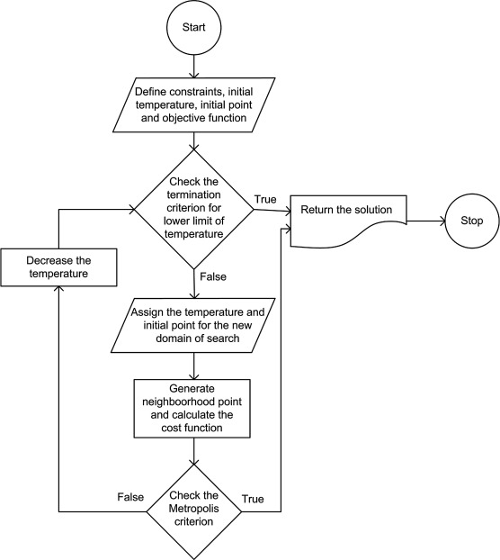
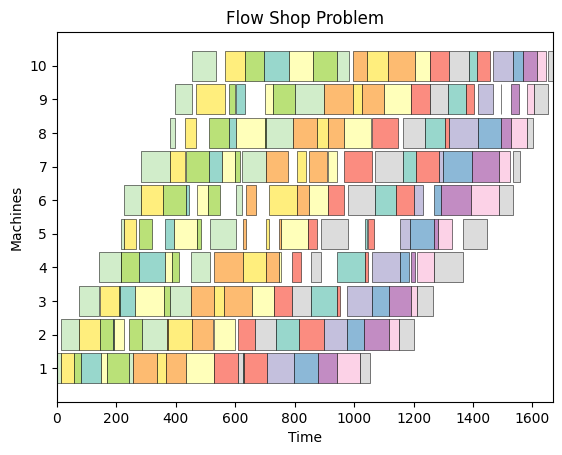
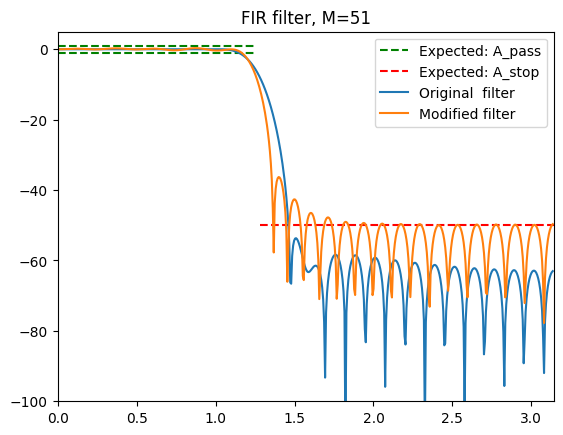
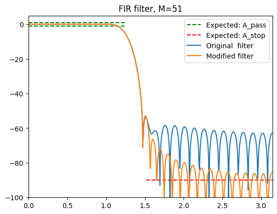

# Algorytmy metaheurystyczne


<p>  
<center> Antoni Bezdzietny </center> 

<center> 249327 </center> 
</p>


---

Algorytmy metaheurystyczne to rodzaj algorytmów optymalizacyjnych, które inspirują się procesami naturalnymi, takimi jak ewolucja, migracja, ogrzewanie i schładzanie. Celem tych algorytmów jest znalezienie optymalnego rozwiązania w problemach, w których tradycyjne algorytmy optymalizacyjne nie dają satysfakcjonujących wyników.

W przeciwieństwie do tradycyjnych algorytmów optymalizacyjnych, algorytmy metaheurystyczne nie gwarantują znalezienia globalnego minimum. Zamiast tego, stanowią próbę znalezienia rozwiązania o wysokiej jakości w stosunkowo krótkim czasie.

# Problem flow-shop scheduling
Flow-shop scheduling to problem harmonogramowania w procesie produkcji, w którym wszystkie zlecenia muszą być wykonywane w kolejności przez te same maszyny, ale każde zlecenie może być przetwarzane na każdej maszynie jednocześnie. Celem jest znalezienie optymalnej kolejności wykonywania zleceń, aby zminimalizować czas produkcji.

$$C = max \sum_{j=1}^n p_j \cdot t_{i,j}$$

$$\text{dla } i = 1,2,\dots,m \text{ i } j = 1,2,\dots,n$$

$\text{gdzie:}$

$p_j - \text{czas wykonania zadania } j \text{ na maszynie } i$

$t_{i,j} - \text{czas potrzebny do wykonania zadania } j \text{ na maszynie } i$

$m - \text{liczba maszyn}$

$n - \text{liczba zadań}.$

Celem jest znalezienie kombinacji $t_{i,j}$, która zminimalizuje wartość funkcji kosztu $C$.


## Wykorzystana baza danych
Baza danych benchmarkowych, która zawiera zestawy testowe dla problemów optymalizacji dyskretnej. Każdy zestaw danych jest opisany w pliku tekstowym i zawiera dane wejściowe i wyjściowe, co umożliwia testowanie i porównywanie różnych algorytmów optymalizacji.

Benchmark Database: OR-Library *J.E. Beasley* <http://people.brunel.ac.uk/~mastjjb/jeb/orlib/flowshopinfo.html>

Wykorzystane zbiory:
- tai20_5 - 20 zadań, 5 maszyn
- tai20_10 - 20 zadań, 10 maszyn
- tai20_20 - 20 zadań, 20 maszyn
- tai50_5 - 50 zadań, 5 maszyn
- tai50_10 - 50 zadań, 10 maszyn
- tai50_50 - 50 zadań, 50 maszyn

<figure>
    <center>
        
        <figcaption>Przykład bazy tai20_10.</figcaption>
    </center>
</figure>


## Wykorzystane algorytmy
---
W tej sekcji przedstawiono algorytmy metaheurystyczne wykorzystane w celu kolejkowania w problemie flow-shop. W analizowanym problemie wykorzystano algorytmy bazujące na sąsiedztwie, rodzaju:
- SWAP - zamiana elementów
- REVERSE_SUBSEQUENCE - odwrócenie kolejności sekwencji
- INSERT_BEFORE - wstaw przed dany element
- INSERT_AFTER - wstaw za dany element

### **Tabu-Search**
**Tabu search** (TS) jest algorytmem metaheurystycznym stosowanym do rozwiązywania problemów optymalizacyjnych. Jego głównym celem jest unikanie zapętlenia się w lokalnym minimum poprzez wprowadzanie ograniczeń na zmiany w rozwiązaniu.

W tabu search, każdy krok algorytmu polega na wyborze najlepszego z sąsiednich rozwiązań. Jednak, aby uniknąć zapętlenia się w lokalnym minimum, niektóre zmiany są oznaczane jako *tabu* i są wykluczane z dalszej analizy. 

Ogólny schemat działania algorytmu tabu search jest następujący:

1. Inicjalizacja początkowego rozwiązania.
2. Utworzenie listy *tabu* i wybór sąsiedniego rozwiązania.
3. Porównanie wartości funkcji celu i wybór najlepszego rozwiązania.
4. Zmiana rozwiązania i dodanie zmiany do listy *tabu*.
5. Powtórzenie kroków 2-4, aż do osiągnięcia zadanego kryterium stopu (np. osiągnięcie maksymalnej liczby iteracji lub wartość funkcji celu).

W algorytmie można również dodać kryterium aspiracji umożliwiające wykonanie kroku z tabeli *tabu*.

<figure>
    <center>
        
        <figcaption>Tabu Search</figcaption>
    </center>
</figure>

### **Algorytm Symulowanego Wyżarzania**
**Algorytm Symulowanego Wyżarzania (SA)** algorytm bazujący na sąsiedztwie, stosowany do rozwiązywania problemów optymalizacyjnych. Algorytm wykorzystuje analogię z fizycznym procesem wyżarzania metalu, aby przeszukać przestrzeń rozwiązań i znaleźć globalne minimum funkcji kosztu.

Algorytm w krokach:
1. Inicjalizacja: Wybierz początkowe rozwiązanie i ustaw początkową temperaturę T.
2. Wybieranie sąsiedniego rozwiązania: Losowo wybierz sąsiednie rozwiązanie.
3. Obliczenie funkcji kosztu nowego rozwiązania.
4. Akceptacja/odrzucenie nowego rozwiązania: Jeśli nowe rozwiązanie jest lepsze niż bieżące rozwiązanie, zaakceptuj je jako bieżące rozwiązanie. W przeciwnym razie, zaakceptuj je z prawdopodobieństwem opartym na temperaturze T.
5. Aktualizacja temperatury: Obniż temperaturę T zgodnie z zadanym schematem.
6. Sprawdzenie warunków końcowych: Sprawdź, czy temperatura T osiągnęła określony próg lub czy została osiągnięta określona maksymalna liczba iteracji. Jeśli warunki nie zostały spełnione, powróć do kroku 2.

Przyjęto poniższe schematy studzenia:
- geometryczny: $ T_k * \left ( \frac{\epsilon}{T_0} \right )^{\frac{1}{N}} $
- logarytmiczny: $\frac{T_k}{1+\frac{T_0}{N*T_0}*T_k}$
- liniowy: $\frac{T_0}{N}$
 
<figure>
    <center>
        
        <figcaption>Simulated Annealing</figcaption>
    </center>
</figure>


### **Threshold Algorithm**
**Threshold Algorithm (TA)** - algorytm bazujący na algorytmie SA, jedyną zmianą jest próg akceptacji rozwiązania pogarszającego rozwiązanie. Przyjęcie nowego rozwiązania odbywa się na podstawie zadanego progu bez części probabilistycznej. 

### **RVNS**
**RVNS (Randomized Variable Neighborhood Search)** to metaheurystyka stosowana do rozwiązywania problemów optymalizacyjnych. Algorytm działa poprzez losowe wybieranie w sąsiedztwie aktualnego rozwiązania i modyfikowanie jej wartości w celu znalezienia lepszego rozwiązania. Proces powtarza się wielokrotnie, aż znalezione rozwiązanie będzie spełniać określone kryteria stopu. 

Kroki algorytmu RVNS:
1. Wybierz początkowe rozwiązanie
2. Losuj typ sąsiedztwa i pozycje zmian
3. Zmodyfikuj wartość wybranego rozwiązania i oblicz nową wartość funkcji celu
4. Porównaj nową wartość funkcji celu z poprzednią i zdecyduj, czy zachować ją jako bieżące rozwiązanie
5. Powtarzaj kroki 2-4, aż zostaną spełnione określone kryteria stopu
6. Zwraca najlepsze znalezione rozwiązanie.


## Uzyskane rezultaty dla zbioru n=20, m=10
---

Dane benchmarkowe *tai20_10* zawierającej zbiór 20 zadań na 10 maszyn. Wszystkie prezentowanie wyniki są uśrednionymi rezultatami dla 10 wykonań.
<figure>
    <center>
        
        <figcaption>Wykorzystany zestaw</figcaption>
    </center>
</figure>

Dane:
- czas początkowy: 2104.0
- granica rozwiązania optymalnego: 1659.0

Algorytm **Tabu Search**:

---
    
Z parametrami:
- maksymalna ilość iteracji: 500
- długość listy tabu: 6
- kryterium aspiracji: 10

| Rodzaj sąsiedztwa | Uzyskane wyniki  | Czas wykonania [s] |
| --------------------- |:------:| -------:|
| SWAP                  | 1711.0 |   11.43 |
| REVERSE_SUBSEQUENCE   | 1723.0 |   10.71 |
| INSERT_BEFORE         | 1698.0 |   11.23 |
| INSERT_AFTER          | 1682.0 |   11.23 |


<figure>
    <center>
        
        <figcaption>Wykresy zbieżności w zależności od sąsiedztwa</figcaption>
    </center>
</figure>

Algorytm **Algorytm Symulowanego Wyżarzania**:

---

Z parametrami:
- maksymalna ilość iteracji: 5000
- początkowa temperatura: 1145
- z podbiciem temperatury w przypadku braku poprawy 

1. Typ spadku temperatury: *geometryczne*

| Rodzaj sąsiedztwa | Uzyskane wyniki  | Czas wykonania [s] |
| --------------------- |:------:| -------:|
| SWAP                  | 1715.8 |   6.30  |
| REVERSE_SUBSEQUENCE   | 1739.7 |   6.28 |
| INSERT_BEFORE         | 1707.1 |   5.95 |
| INSERT_AFTER          | 1702.8 |   6.36 |

2. Typ spadku temperatury: *logarytmiczny*

| Rodzaj sąsiedztwa | Uzyskane wyniki  | Czas wykonania [s] |
| --------------------- |:------:| -------:|
| SWAP                  | 1714.4 |   5.51 |
| REVERSE_SUBSEQUENCE   | 1732.7 |   6.28 |
| INSERT_BEFORE         | 1706.0 |   5.57 |
| INSERT_AFTER          | 1694.1 |   5.73 |

<figure>
    <center>
        
        <figcaption>Algorytm SA z geometryczną funkcją studzenia z podbiciem. </figcaption>
    </center>
</figure>

<figure>
    <center>
        
        <figcaption>Algorytm SA z logarytmiczną funkcją studzenia z podbiciem. </figcaption>
    </center>
</figure>

<figure>
    <center>
        
        <figcaption>Algorytm SA z logarytmiczną funkcją studzenia bez podbicia. </figcaption>
    </center>
</figure>

Algorytm **Threshold Algorithm (TA)**:

---

Z parametrami:
- maksymalna ilość iteracji: 5000
- początkowa temperatura: 1000
- z podbiciem temperatury w przypadku braku poprawy 

1. Typ spadku temperatury: *geometryczne*

| Rodzaj sąsiedztwa | Uzyskane wyniki  | Czas wykonania [s] |
| --------------------- |:------:| -------:|
| SWAP                  | 1718.7 |   6.35  |
| REVERSE_SUBSEQUENCE   | 1749.6 |   5.88 |
| INSERT_BEFORE         | 1700.5 |   5.51 |
| INSERT_AFTER          | 1703.8 |   5.971 |

2. Typ spadku temperatury: *logarytmiczny*

| Rodzaj sąsiedztwa | Uzyskane wyniki  | Czas wykonania [s] |
| --------------------- |:------:| -------:|
| SWAP                  | 1711.4 |   5.61 |
| REVERSE_SUBSEQUENCE   | 1726.3 |   5.70 |
| INSERT_BEFORE         | 1691.1 |   5.60 |
| INSERT_AFTER          | 1696.2 |   5.46 |


Algorytm **RVNS**:

---

Z parametrami:
- k' iteration: 1000
- k'' iteration: 500

| Rodzaj sąsiedztwa | Uzyskane wyniki  | Czas wykonania [s] |
| --------------------- |:------:| -------:|
| Zmienne                  | 1669.0 |   610.17 |

<figure>
    <center>
        
        
        <figcaption>Przykładowe rozwiązanie z czasem 2104 -> 1669 </figcaption>
    </center>
</figure>


## Uzyskane wyniki dla zbioru n=50, m=20
---

Dane benchmarkowe *tai50_20* zawierającej zbiór 50 zadań na 20 maszyn. Wszystkie prezentowanie wyniki są uśrednionymi rezultatami dla 10 wykonań. Testowana rozwiązania przynoszące najlepsze wyniki dla mniejszego zbioru.

Dane:
- czas początkowy: 4730.0
- granica rozwiązania optymalnego: 3715.0

Algorytm **Tabu Search** *INSERT_AFTER* *154.430s* : 3816.0

Algorytm **Symulowanego Wyżarzania** *INSERT_BEFORE* *29.56s*: 3921.9

Algorytm **Threshold Algorithm** *INSERT_BEFORE* *30.73s*: 3946.1

Algorytm **RVNS** *3153.11s*: 3960.0


<figure>
    <center>
        
        
        <figcaption>Przykładowe rozwiązanie z czasem 4730 -> 3816 </figcaption>
    </center>
</figure>
## Wnioski
---
Liczba możliwych kombinacji w problemie flow shop zależy od wielu czynników, takich jak liczba maszyn, liczba zadań, ograniczenia czasowe itp. W niektórych przypadkach liczba kombinacji może być bardzo duża i przekraczać możliwości obliczeniowe dostępnych komputerów. Dlatego stosuje się heurystyki i algorytmy optymalizacyjne, aby znaleźć dobre, a niekoniecznie najlepsze, rozwiązanie.

W analizowanych przypadkach najlepiej poradziła sobie metoda ze zmiennym sąsiedztwem osiągając wynik **1669** wartość bliską ograniczeniu (**1659**). Jednak czas wykonania wyniósł ponad *610s*.  Algorytm Tabu Search osiągnął wartość **1682** w *11s*. Algorytmy TA oraz SA osiągnęły wartości bliskie **1693**
w czasie *6s*.

Na podstawie powyższych wyników można również zaobserwować iż podobne do siebie algorytmy **SA** oraz **TA** osiągają zbliżone wyniki jak **Tabu Search** czy **RVNS** zajmując przy tym najmniej zasobów.

W metodach opartych na sąsiedztwie najlepsze wyniki uzyskano dla sąsiedztw *INSERT_BEFORE* i *INSERT_AFTER*, może to wynikać z zachowania już zoptymalizowanych podciągów. Sąsiedztwo *REVERSE_SUBSEQUENCE* w każdym z analizowanych algorytmów dostarczało najgorsze rozwiązania. 

Zalety algorytmów metaheurystycznych bazujących na sąsiedztwie:

- Elastyczność - możliwość dostosowania do różnych problemów optymalizacyjnych
- Skuteczność - wysokie prawdopodobieństwo znalezienia globalnego minimum/maksimum.
- Szybkość - szybka zbieżność do rozwiązania optymalnego.

Wady algorytmów metaheurystycznych bazujących na sąsiedztwie:

- Brak gwarancji znalezienia optymalnego rozwiązania.
- Zależność od parametrów - konieczność doboru odpowiednich parametrów aby uzyskać dobre wyniki.

# Poprawa parametrów filtru - metaheurystyki 
FIR (Finite Impulse Response) to filtr cyfrowy, w którym odpowiedź impulsowa jest ograniczona w czasie.

$$y[n]=\sum_{i=0}^{M-1} b_i x[n-i]$$

Celem, jest poprawa uzyskanych współczynników wyznaczonych metodą okna, w tym przypadku z wykorzystaniem okna *Hamminga*. Testowana były filtry dolnoprzepustowe.

<figure>
    <center>
        
        <figcaption>Parametry filtru LP FIR </figcaption>
    </center>
</figure>

## Zaproponowane algorytmy 
---
### **RVNS Continuous**
Algorytm bazuje na wyżej opisywanym *RVNS*, zmieniono typ sąsiedztwa. Sąsiedztwo bazuje na zmianie pojedynczej wartości współczynnika filtru. Dopuszczalne jest pogorszenie algorytmu o jeden krok wstecz (pogorszenie wyniku w k-tym kroku musi poprawić wynik w k+1 kroku).

Kroki algorytmu:
1. Inicjalizacja rozwiązania początkowego bazującego na metodzie okna
2. Zaburzenie losowego współczynnika filtru wartością z $\sigma_1 *randn()$
3. Dla nowego rozwiązania sprawdź $k''$ rozwiązań sąsiednich $x''$ 
4. Zaburzenie losowego współczynnika filtru wartością z $\sigma_2 *randn()$
5. Aktualizacja parametru $\sigma_2$
6. Zapisz najlepsze rozwiązanie $x''$
7. Jeżeli wartość rozwiązania $x''$ jest mniejsza od najlepszego rozwiązania zapamiętaj.
8. Jeżeli wartość rozwiązania $x''$ jest mniejsza od obecnego zapisz jako obecne.
9. Po osiągnięciu warunku stopu zwróć najlepszy wynik.

Wartości $\sigma_1$ oraz $\sigma_2$ są wartościami liniowo malejącymi z przedziału 1e-3 ... 1e-6.

Parametry k' oraz k'' odpowiada za ilość iteracji.


### **Hybryda algorytmu genetycznego oraz RVNS**
Algorytm genetyczny (GA) jest metaheurystycznym podejściem do rozwiązywania problemów optymalizacyjnych. Inspirowany jest ideą ewolucji i dziedziczenia genów w biologii.

Algorytm działa w następujący sposób:

1. Inicjalizacja populacji: początkową populacją są współczynniki filtru wyznaczone metodą okien 
2. Ocena: każde rozwiązanie w populacji jest oceniane za pomocą funkcji celu, która określa jego jakość.
3. Selekcja: najlepsze rozwiązania są wybierane do dalszej reprodukcji, a reszta jest odrzucana.
4. Krzyżowanie (reprodukcja): wybrane rozwiązania są łączone wykorzystując permutacje najlepszych rozwiązań, tworząc nowe rozwiązania, które reprezentują kombinację losowych cech rodziców.
5. Mutacja: losowe zmiany są wprowadzane do nowych rozwiązań, aby zapewnić zmienność i uniknąć zakleszczenia w lokalnym minimum. W tym celu wykorzystywany jest wyżej omawiany *RVNS*.
6. Powtarzanie kroków 2-5, aż do osiągnięcia zadanej liczby iteracji lub zadanej wartości funkcji celu.

## Uzyskane wyniki
---
Poniżej przedstawiono przykładowe wyniki.


### **Przykład próby zawężenia pasma przejściowego**
Zadane parametry:
```python
filter = {
    'N_fft':   512,     # FFT N próbek -> 2^m
    'm_order': 51,      # Długość filtru
    'fs':      48e3,    # Częstotliwość próbkowania
    'f_pass':  9.6e3,   # Częstotliwość graniczna pasma zaporowego
    'tr_band': 0.2e3,   # Szerokość pasma przejściowego
    'd1_db':   1,       # df1 [db] maksymalne pulsacje w paśmie przepustowym
    'd2_db':   -50,     # df2 [db] minimalna wartość tłumienia w paśmie zaporowym
}
```

**Metoda RVNS-C**
<figure>
    <center>
        
        <figcaption>Uzyskane rezultaty metodą RVNS-C </figcaption>
    </center>
</figure>

Czas wykonania: 285.968

Parametry filtru początkowego:
- Wartość funkcji kosztu (metoda okna): 40.3648 
- Pasmo przejściowe (metoda okna): 1603.12 Hz

Parametry filtru zmodyfikowanego:
- Wartość funkcji kosztu (metoda sąsiedztwo): 17.8185 
- Pasmo przejściowe (metoda sąsiedztwo): 853.12 Hz

**Hybryda algorytmu genetycznego oraz RVNS**
<figure>
    <center>
        
        <figcaption>Uzyskane rezultaty metodą hybrydową </figcaption>
    </center>
</figure>

Czas wykonania: 202.077

Parametry filtru początkowego:
- Wartość funkcji kosztu (metoda okna): 40.3648 
- Pasmo przejściowe (metoda okna): 1603.12 Hz

Parametry filtru zmodyfikowanego:
- Wartość funkcji kosztu (metoda hybrydowa): 15.7287 
- Pasmo przejściowe (metoda hybrydowa): 571.87 Hz


### **Przykład próby poprawy tłumienia w paśmie zaporowym**
Zadane parametry:
```python
filter = {
    'N_fft':   512,     # FFT N próbek -> 2^m
    'm_order': 51,      # Długość filtru
    'fs':      48e3,    # Częstotliwość próbkowania
    'f_pass':  9.6e3,   # Częstotliwość graniczna pasma zaporowego
    'tr_band': 2e3,   # Szerokość pasma przejściowego
    'd1_db':   1,       # df1 [db] maksymalne pulsacje w paśmie przepustowym
    'd2_db':   -90,     # df2 [db] minimalna wartość tłumienia w paśmie zaporowym
}
```
**Metoda RVNS-C**
<figure>
    <center>
        
        <figcaption>Uzyskane rezultaty metodą RVNS-C </figcaption>
    </center>
</figure>

Czas wykonania: 288.034

Parametry filtru początkowego:
- Wartość funkcji kosztu (metoda okna): 11.2398  
- Pasmo przejściowe (metoda okna): 3337.50 Hz

Parametry filtru zmodyfikowanego:
- Wartość funkcji kosztu (metoda sąsiedztwo): 5.2243 
- Pasmo przejściowe (metoda hybrydow): 3712.50 Hz

**Hybryda algorytmu genetycznego oraz RVNS**
<figure>
    <center>
        
        <figcaption>Uzyskane rezultaty metodą hybrydową </figcaption>
    </center>
</figure>

Czas wykonania: 204.768

Parametry filtru początkowego:
- Wartość funkcji kosztu (metoda okna): 11.2398  
- Pasmo przejściowe (metoda okna): 3337.50 Hz

Parametry filtru zmodyfikowanego:
- Wartość funkcji kosztu (metoda hybrydowa): 6.8189 
- Pasmo przejściowe (metoda hybrydowa): 3009.37 Hz


## Wnioski
---
Wykorzystanie heurystyk w przypadku poprawy tłumienia w paśmie zaporowym, jak i zmniejszeniu szerokości pasma przejściowego umożliwia poprawienie charakterystyki filtru.

W obu przypadkach zaproponowany algorytm hybrydowy wykorzystujący własności algorytmu genetycznego oraz algorytmu bazującego na sąsiedztwie dostarczyły rozwiązań o lepszej charakterystyce. 

W przypadku poprawy współczynników filtru istotną kwestią jest rozpoczęcie od rozwiązania 'dobrego', a następnie próba jego poprawienia dopuszczając pogorszenie tylko kilka modyfikacji wstecz. Dzięki temu zapewniamy zbieżność.

W przypadku modelowania współczynników heurystykami, istotną rolę odgrywa dobrze zaproponowana funkcja kosztu. Warto zwrócić uwagę na korzystanie ze skali logarytmicznej. Wartości w paśmie zaporowym są bardzo małe przez co wyznaczenie np. odległości euklidesowej nie jest najlepszym rozwiązaniem.


<script type="text/javascript" src="http://cdn.mathjax.org/mathjax/latest/MathJax.js?config=TeX-AMS-MML_HTMLorMML"></script>
<script type="text/x-mathjax-config">
        MathJax.Hub.Config({ tex2jax: {inlineMath: [['$', '$']]}, messageStyle: "none" });
</script>